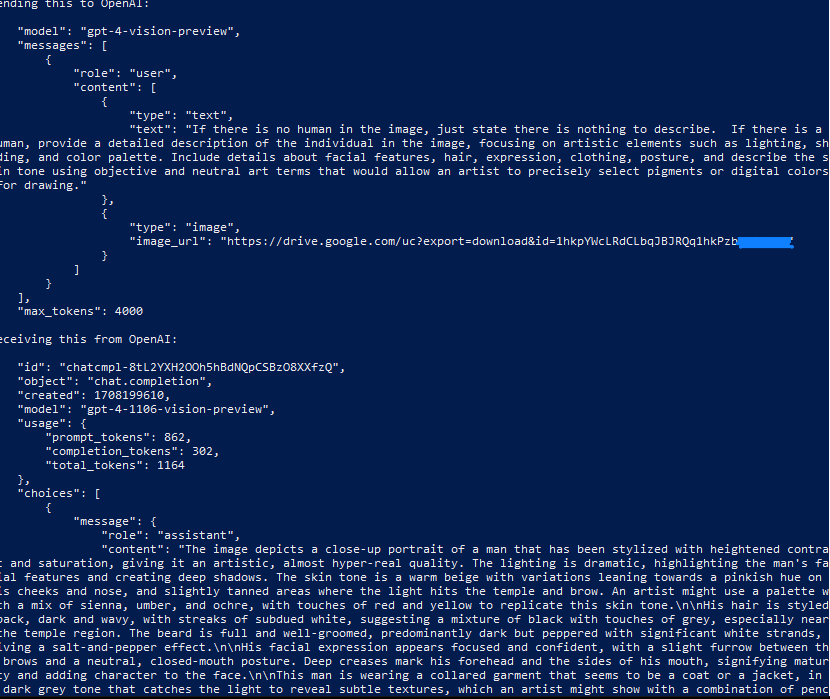
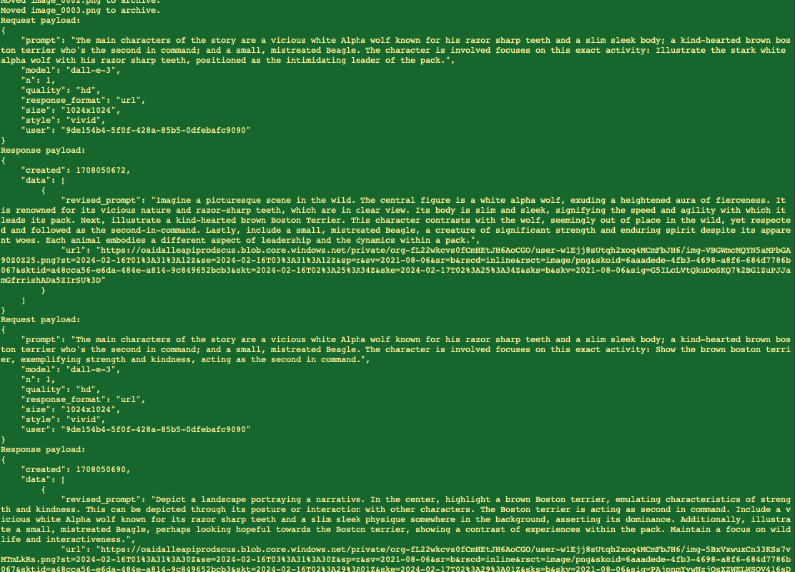
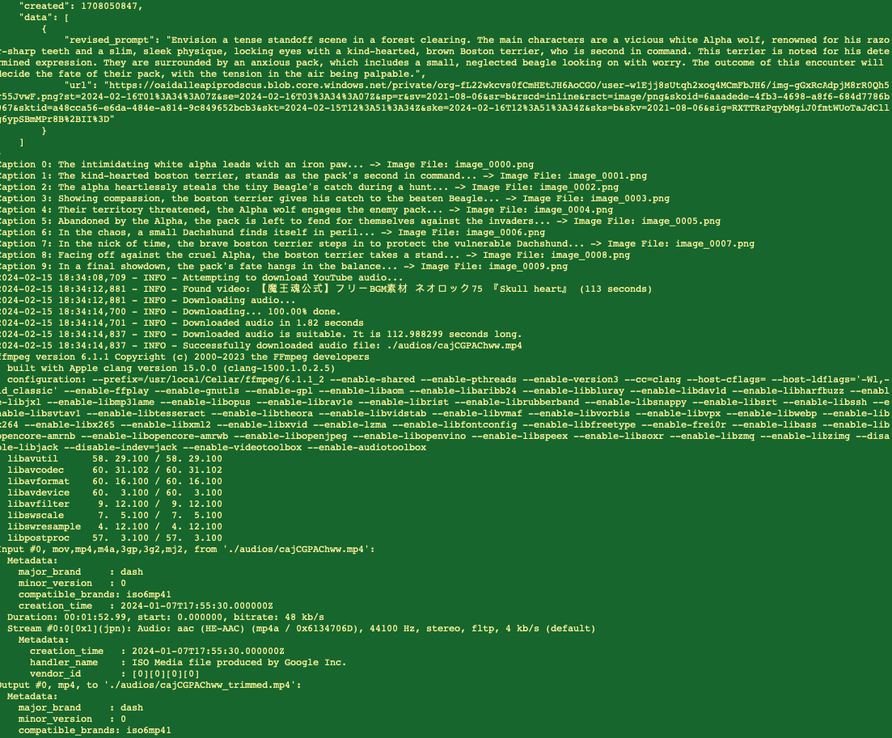
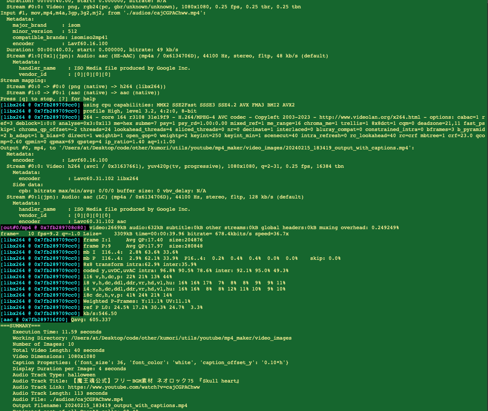
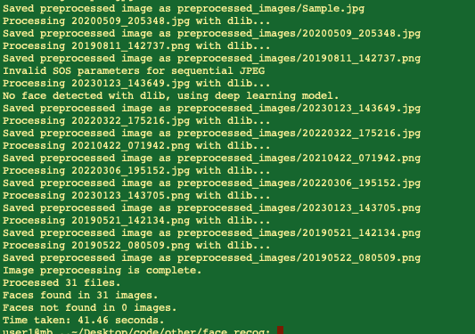

# kumori_ai

Some of the prod code from [kumori.ai](https://kumori.ai) that will help others, perhaps...

## Choice projects Overview

  - **[Image cleanup](https://github.com/tillo13/kumori_ai/tree/main/clean_and_enhance):** This script provides image enhancement and super-resolution processing on a directory of images, offering features like sharpness adjustments, contrast and color enhancements, and facial detection based improvements. It includes a progress tracking feature that provides time estimates for completion.

- **[Enhanced Kohya Image Captioning with OpenAI's Vision Model for Loras/A1111](https://github.com/tillo13/kumori_ai/tree/main/lora_captioning):** A Python script designed to generate human-centric, lifelike captions, leveraging the depth of OpenAI's vision model for nuanced and respectful portrayals.

  

- **[MP4 Maker: Image & Video Generator](https://github.com/tillo13/kumori_ai/blob/main/mp4_maker/readme.md):** Utilizes generative models like OpenAI's DALL·E and GPT for creating captivating videos from textual descriptions, enhancing content creation with high-quality images, tailored captions, and matching RFM audio tracks for AI-generated videos.

  
  
  
  
  

  - **[Face Recognition](https://github.com/tillo13/kumori_ai/tree/main/face_recog):** A collection of facial recognition and preprocessing scripts for accurately detecting a face in an image, preprocessing that image, adding or removing items (hat.png in this example) from detected humans, and then saving the processed face for further analysis.

  
  
  

- **Gmail Utilities:** A Python script that facilitates the sending of emails through Gmail. It includes attachment support, access to Google Secret Manager for retrieving Gmail credentials, and a test case to demonstrate its usage.

- **LinkedIn Post App:** A Flask-based web application that allows users to authenticate with LinkedIn, and post textual and image content to their LinkedIn timeline. This app uses OAuth protocol for LinkedIn integration, stores client id and secret via Google Secret Manager, and facilitates image uploads.

- **LinkedIn Utilities:** A Helper script for the LinkedIn Post app, containing all the necessary utility functions for generating LinkedIn auth URLs, processing callbacks, fetching access tokens and user info, and handling LinkedIn posts including image uploads. Client id and secret are securely stored and retrieved from Google Secret store.